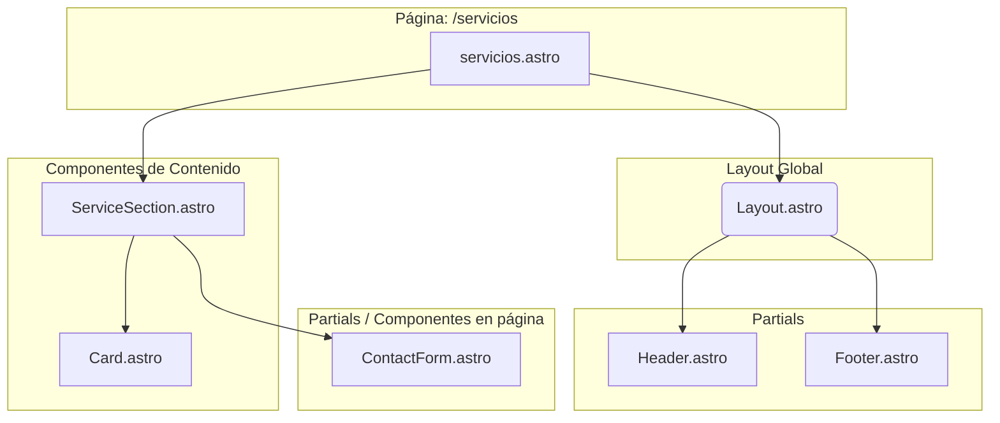
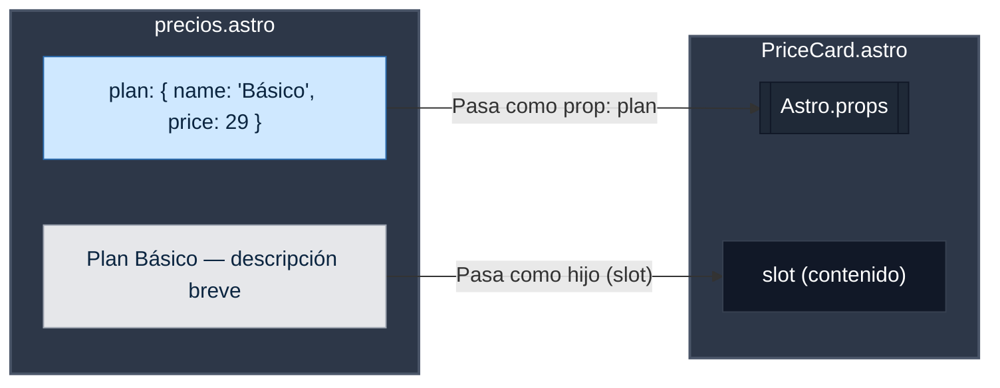
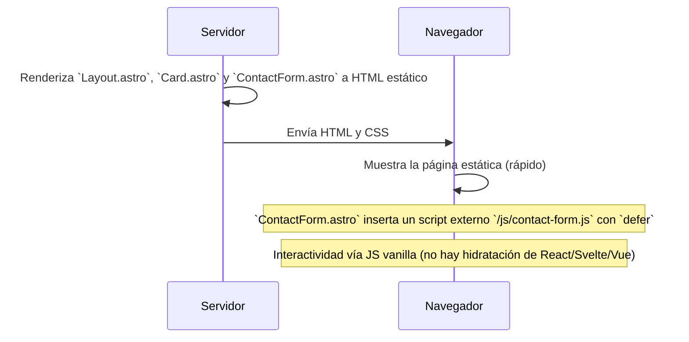

# Arquitectura de Componentes en Astro.js

Como experto en Astro.js, he preparado esta guía para documentar la arquitectura de componentes utilizada en este proyecto. El objetivo es clarificar cómo se estructuran, comunican y renderizan los componentes, siguiendo las mejores prácticas de Astro.

## 1. Tipos de Componentes en Astro

Astro utiliza una arquitectura flexible que combina componentes renderizados en el servidor con "islas" interactivas renderizadas en el cliente.

### a. Componentes `.astro`

Son el pilar de cualquier proyecto en Astro. No tienen estado y se renderizan completamente en el servidor a HTML y CSS, enviando cero JavaScript al cliente por defecto.

- **Estructura**:
  - **Frontmatter (Code Fence)**: El bloque de código entre `---` donde se escribe JavaScript/TypeScript para la lógica del componente (importaciones, fetching de datos, definición de props).
  - **Template (JSX-like)**: El cuerpo del componente, que se parece a HTML pero con sintaxis de JSX. Aquí se renderiza el marcado y se usan expresiones de JavaScript.

**Ejemplo (`src/components/Button.astro`):**

```astro
---
// 1. Frontmatter: Lógica del servidor
interface Props {
  label: string;
  href: string;
  variant?: 'primary' | 'secondary';
}
const { label, href, variant = 'primary' } = Astro.props;
---
<!-- 2. Template: Marcado renderizado a HTML -->
<a href={href} class={`btn btn-${variant}`}>
  {label}
</a>
```

### b. Componentes de Frameworks (Islas Interactivas)

Para la interactividad en el cliente (ej. formularios, carruseles), Astro utiliza **componentes de frameworks** como React, Svelte o Vue. Estos componentes se integran como "islas" que se "hidratan" en el navegador.

- **Uso**: Se importan en un componente `.astro` y se renderizan con una directiva `client:*`.
- **Directivas `client:*`**: Controlan cuándo y cómo se carga el JavaScript del componente.
  - `client:load`: Carga el JS inmediatamente. Usar para elementos críticos visibles desde el inicio.
  - `client:idle`: Carga cuando el navegador está inactivo. Ideal para componentes de baja prioridad.
  - `client:visible`: Carga cuando el componente entra en el viewport. Es la opción más común y eficiente para contenido "below the fold".

**Ejemplo (Hipotético `ContactForm.jsx`):**

```jsx
// src/components/ContactForm.jsx (React)
import { useState } from "react";

export default function ContactForm() {
  const [name, setName] = useState("");
  // ...lógica del formulario
  return <form>{/* ... */}</form>;
}
```

**Integración en Astro:**

```astro
---
import ContactForm from '@/components/ContactForm.jsx';
---
<!-- El JS de React solo se cargará cuando el formulario sea visible -->
<ContactForm client:visible />
```

### c. Layouts y Partials

- **Layouts (`src/layouts/`)**: Son componentes `.astro` especiales que definen la estructura común de una o varias páginas (ej. `<html>`, `<head>`, `<body>`). Usan la etiqueta `<slot />` para inyectar el contenido específico de cada página.
- **Partials (`src/components/` o `src/partials/`)**: Son componentes `.astro` reutilizables que forman parte de un layout, como `Header.astro`, `Footer.astro` o `Sidebar.astro`. No son una característica formal de Astro, sino una convención de organización.

## 2. Relaciones Clave y Flujo de Datos

### a. Flujo de Props (Padre a Hijo)

Los datos fluyen de manera unidireccional desde los componentes padres hacia los hijos a través de `props`, de forma similar a otros frameworks.

### b. Composición con Slots

Los `slots` son la herramienta principal de Astro para la composición. Permiten que un componente padre pase contenido HTML (o más componentes) a un hijo.

- **Slot por defecto**: `<slot />` renderiza todos los hijos pasados sin un nombre de slot específico.
- **Slots nombrados**: `<slot name="nombre" />` permite inyectar contenido en lugares específicos del template del hijo.

**Ejemplo (`Card.astro`):**

```astro
---
// src/components/Card.astro
---
<div class="card">
  <div class="card-header">
    <slot name="header" /> <!-- Slot para el título -->
  </div>
  <div class="card-body">
    <slot /> <!-- Slot por defecto para el contenido principal -->
  </div>
</div>
```

**Uso:**

```astro
---
import Card from '@/components/Card.astro';
---
<Card>
  <h2 slot="header">Título de la Tarjeta</h2>
  <p>Este es el contenido principal que va en el slot por defecto.</p>
</Card>
```

## 3. Diagramas de Arquitectura (Mermaid)

Estos diagramas visualizan la estructura y el flujo de datos en una aplicación Astro típica.

### a. Diagrama de Jerarquía de Componentes

Muestra cómo se anidan los componentes desde la página hasta los elementos más pequeños.



**Explicación**: La página `servicios.astro` usa `Layout.astro`, que a su vez incluye `Header` y `Footer`. La página renderiza una sección de servicios que contiene múltiples `Card` (estáticas) y un `ContactForm.astro` (renderizado en servidor). En este proyecto la interactividad del formulario se implementa con un script externo (por ejemplo `/js/contact-form.js`), no mediante hidratación de un framework.

### b. Diagrama de Flujo de Datos (Props y Slots)

Ilustra cómo la información y el contenido fluyen a través de la jerarquía.



**Explicación**: La página `precios.astro` define un objeto `plan` y contenido HTML. Pasa el objeto como una `prop` al componente `PriceCard.astro` y el HTML como un hijo que será renderizado por el `<slot />` del componente.

### c. Diagrama de Renderizado (Servidor vs. Cliente)

Diferencia qué componentes se renderizan en el servidor y cuáles se hidratan en el cliente.



**Explicación**: El servidor pre-renderiza la mayor parte de la página y el navegador muestra el HTML estático inmediatamente. En general Astro soporta el patrón de "islas" (hidratar componentes de React/Vue/Svelte cuando se necesita), pero en este repositorio actualmente no se usan islas: la interactividad se proporciona con scripts externos y handlers (`/js/contact-form.js`) en componentes `.astro`.

## 4. Recomendaciones y Buenas Prácticas

1.  **Organización de Componentes**:

    - `src/layouts/`: Solo para layouts de página completos.
    - `src/components/`: Componentes reutilizables de UI (`Button`, `Card`).
    - `src/components/sections/`: Componentes más grandes que agrupan otros componentes para formar secciones de una página (`HeroSection`, `Testimonials`).
    - `src/components/icons/`: Si usas iconos SVG como componentes.

2.  **Casos de Uso**:

    - **`.astro`**: Para todo lo que sea estático. El 90% de tu sitio web (texto, imágenes, estructura).
    - **Componentes de Framework**: Solo cuando necesites estado o eventos en el cliente (formularios, galerías interactivas, carritos de compra).

3.  **Errores Comunes y Cómo Evitarlos**:
    - **Error**: Usar un componente de framework para contenido estático.
      - **Solución**: Conviértelo a un componente `.astro`. No pagues el coste de JS si no hay interactividad.
    - **Error**: Pasar `props` complejas (como funciones) a islas interactivas.
      - **Solución**: Las `props` para islas deben ser serializables (JSON). Para comunicación compleja, usa eventos de JavaScript o stores globales.
    - **Error**: Abusar de `client:load`.
      - **Solución**: Usa `client:visible` por defecto. `client:load` retrasa el `Time to Interactive` de tu página. Resérvalo solo para UI crítica e inmediata.
